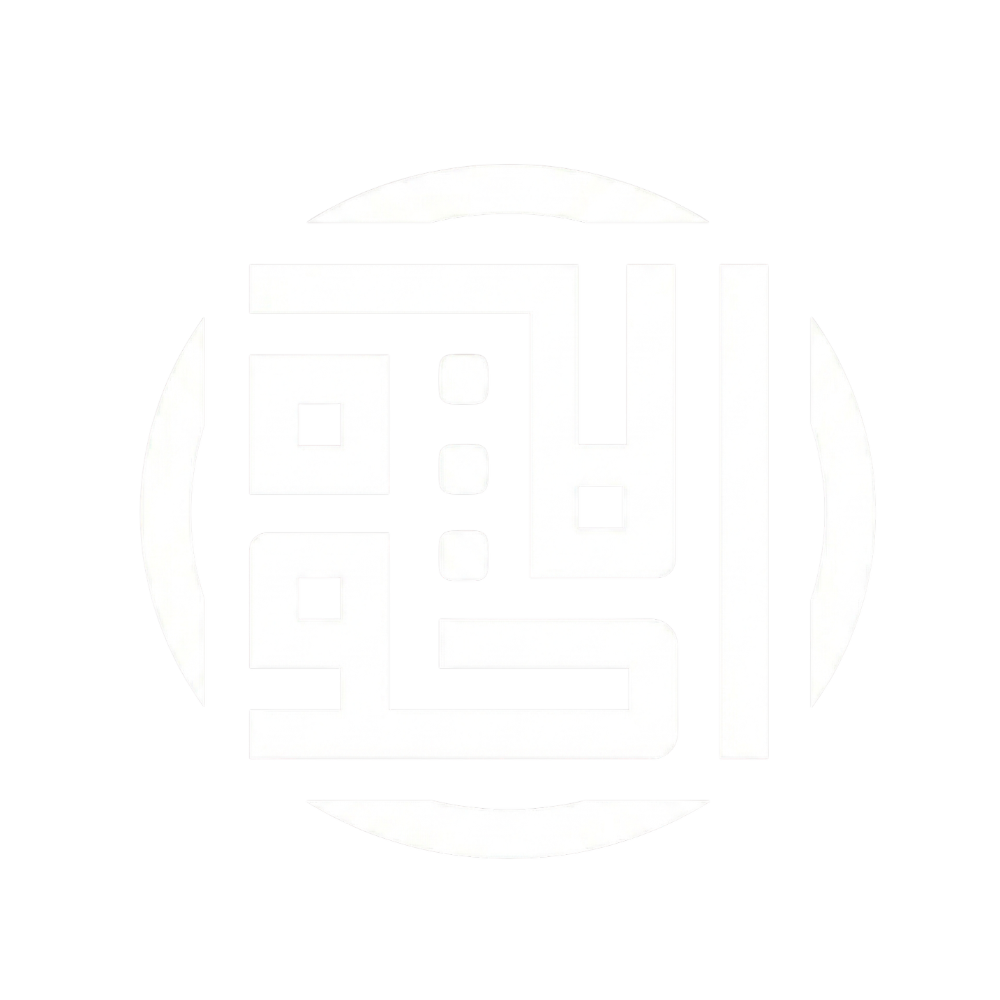

# Al Ukhuwah - Muslim App

<p align="center">
  
</p>

<p align="center">
  <strong>Bismillah. Aplikasi Muslim modern untuk bantu ibadah harian dengan tampilan hangat dan fokus ke kenyamanan pengguna.</strong>
</p>

## Tentang Project
Al Ukhuwah adalah aplikasi mobile berbasis **React Native + Expo** yang menyediakan fitur-fitur islami utama seperti Al-Quran, detail ayat dengan audio, doa harian, dzikir, hadits, artikel islam, arah kiblat, serta AI Muslim chat.

Project ini dibangun untuk pengalaman yang:
- rapi secara UI/UX,
- ringan dipakai harian,
- dan mudah dikembangkan lagi per modul.

<p align="center">
  
</p>

## Fitur Utama
- Home dashboard islami (jadwal sholat, countdown, quick access, renungan).
- Al-Quran list surat + detail surat.
- Audio ayat per-reciter dengan kontrol play/pause/next/prev.
- Bookmark surat dan bookmark ayat.
- Doa harian + halaman detail doa.
- Dzikir harian dengan mode baca expand/collapse.
- Hadits dengan tampilan interaktif expand/collapse.
- Asmaul Husna.
- Arah Kiblat.
- Artikel islam dari feed eksternal.
- AI Muslim chat screen (UI + flow chat).
- Dark mode / Light mode.

## Fitur Detail Quran (Baru)
Di halaman **Detail Surat**, sekarang sudah ada:
- Tombol **Settings** khusus detail Quran.
- Pilih **reciter sebelum play** (tanpa harus mulai audio dulu).
- Toggle tampilkan/sembunyikan terjemahan.
- Toggle auto-scroll ke ayat yang sedang diputar.
- Toggle getar (haptic) saat swipe pindah surat.
- Atur ukuran teks Arab.
- Atur ukuran teks terjemahan.
- Pengaturan loop (`Off`, `Loop Ayat`, `Loop Surat`).
- Tombol **reset ke default**.
- Tombol **scroll ke atas** (back to top) saat user sudah scroll jauh.

## Struktur Menu (Ringkas)
- Tab utama:
  - `Home`
  - `Quran`
  - `AI Chat`
  - `Artikel`
  - `Settings`
- Halaman tambahan:
  - `Doa_harian`
  - `Dzikir`
  - `Hadits`
  - `Asmaul_husna`
  - `Arah_kiblat`
  - `Detail_surat`
  - `Detail_doa`
  - `Detail_dzikir`
  - `Detail_hadits`

## Tech Stack
- Expo SDK 54
- React Native 0.81
- React 19
- Expo Router (file-based routing)
- React Navigation Bottom Tabs
- Reanimated + Gesture Handler
- Expo AV (audio)
- Expo Haptics
- Async Storage

## Sumber Data API
Beberapa endpoint yang dipakai app:
- Quran list surat: `https://quran-api.santrikoding.com/api/surah`
- Quran detail surat: `https://quran-api.santrikoding.com/api/surah/{nomor}`
- Audio ayat per reciter: `https://quranapi.pages.dev/api/audio/{surah}/{ayah}.json`
- Jadwal sholat (default city Jakarta): `https://api.aladhan.com/v1/timingsByCity`
- Hadits: `https://muslim-api-three.vercel.app/v1/hadits`
- Dzikir: `https://muslim-api-three.vercel.app/v1/dzikir`
- Artikel islam: feed Republika via RSS2JSON

## Cara Menjalankan
### 1. Install dependency
```bash
npm install
```

### 2. Jalankan project
```bash
npx expo start
```

### 3. Jalankan target platform
```bash
npm run android
npm run ios
npm run web
```

## Script NPM
- `npm run start` - Menjalankan Expo dev server.
- `npm run android` - Build/run ke Android.
- `npm run ios` - Build/run ke iOS.
- `npm run web` - Menjalankan versi web.
- `npm run lint` - Linting project.

## Catatan Pengembangan
- Theme sudah mendukung light/dark di layar utama (termasuk tab bar dan detail Quran).
- Beberapa modul API memakai fallback agar tetap aman saat request gagal.
- Untuk pengalaman terbaik, gunakan device/emulator dengan permission internet aktif.

## Kontribusi
Masukan, issue, dan pull request sangat terbuka.

Kalau mau nambah modul baru, disarankan pakai pola yang sama:
- file route di folder `app/`,
- state + theme konsisten,
- dan reusable UI pattern antar halaman.

## Penutup
Semoga aplikasi ini bermanfaat dan jadi amal jariyah.

> "Sebaik-baik manusia adalah yang paling bermanfaat bagi manusia lainnya."


<p align="center">
  
</p>
